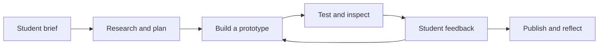

# Ink & Wishes — 墨与愿

**Learn a character. Practise with ink. Create a wish in your own handwriting.**

Ink & Wishes is an interactive Chinese calligraphy website for beginners. It brings together character lessons, stroke-order games, a textured digital brush, and creative activities inspired by Chinese culture. A guided first visit takes learners from a scratch-paper brushstroke to 安 (ān, peace or safety), then to a personal keepsake with their own handwriting and message. Visitors can also practise six individual characters, design a red envelope, or write a complete Spring Festival couplet.

Built as an **agentic-workflow homework project**, it documents how a student directed an AI coding agent through research, prototyping, feedback, testing, and publication. The goal is to explore an idea through iteration and understand the workflow behind the result.

**[Open the website](https://jiayingcc.github.io/AgentHomework/)** · **[Write a spring couplet](https://jiayingcc.github.io/AgentHomework/#couplets)** · **[Explore the AI workflow](https://jiayingcc.github.io/AgentHomework/#process)**

## What you can do

| Experience | What it includes |
| --- | --- |
| **Make a first keepsake** | Try the brush, learn 安 with directional stroke animations, answer two optional recall questions, add a dedication, and seal or open the envelope. |
| **Learn six characters** | 山 (mountain), 水 (water), 永 (lasting), 安 (peace), 春 (spring), and 福 (good fortune), with pronunciation, meaning, cultural context, and references. |
| **Follow stroke order** | Play, pause, or step through a character's stroke sequence, then try a short next-stroke game with explanations and retries. |
| **Write with a digital brush** | Tapered strokes, bristle texture, speed-responsive width, adjustable brush size and ink load, optional tracing guides, undo, and redo. |
| **Create Spring Festival couplets** | Choose a five- or seven-character example, or enter your own 上联 (right strip), 下联 (left strip), and 横批 (top banner). Write each character separately and preview the assembled red-paper design. |
| **Make a red-envelope design** | Turn your handwritten practice into a digital red-envelope front. |
| **Save and export** | Keep up to three editable works in your browser, reopen them to continue, or download a PNG to share. |
| **Understand the development process** | Explore the “Behind the ink” page, learn six workflow terms, and build a prompt for your next AI-assisted iteration. |

The visual style combines a **minimal neutral palette, translucent glass controls, white writing paper, and a subtle ink-wash landscape**. Red is used for the couplet and envelope paper.

## A quick first visit

1. Open **Start here** and try a mark on the scratch paper.
2. Meet **安 / ān / peace or safety**. Trace the six strokes, watch the reference, or try without the guide.
3. Try the optional two-question recall, then add a recipient, message, and signature if you like.
4. Seal the envelope and preview its opening. Your actual handwritten marks become the keepsake.
5. Save an editable copy in **My keepsakes**, or download a PNG. Continue with **Free practice** or **Couplets** whenever you like.

Couplets use a clearly labeled traditional arrangement: when facing the doorway, the upper line is on the right, the lower line is on the left, and the heading reads from right to left. Custom lines must have equal lengths of 2–9 Chinese characters; headings accept 2–6. Unwritten spaces stay blank in the exported image.

| PNG export | Size |
| --- | --- |
| Personal keepsake with dedication | 1200 × 1800 pixels |
| Practice sheet | 1200 × 1200 pixels |
| Red-envelope front | 1200 × 2000 pixels |
| Complete couplet composition | 1800 × 1700 pixels |

## The AI-assisted workflow

The student chose the subject, visual direction, and priorities. One coding agent carried out research, implementation, testing, and deployment, with student feedback guiding the next changes.



The first working version connected a single 福 lesson to a saved keepsake. Later feedback led to a more expressive brush, the ink-wash background, six connected character lessons, the couplet workshop, and a guided beginner journey with personal messages and envelope motion. The repository records actual changes, source checks, and verification results so the process can be discussed as part of the assignment.

The website runs entirely in the browser. Its workflow guide explains AI-assisted development, and its prompt builder generates text to use with a coding agent; it does not call an AI service.

- [Guided journey: implementation and verification](assignments/03-ink-and-wishes/notes/guided-journey-implementation.md)
- [Development workflow and review/fix examples](assignments/03-ink-and-wishes/notes/workflow.md)
- [Brush and background iteration](assignments/03-ink-and-wishes/notes/brush-iteration.md)
- [Character-library iteration](assignments/03-ink-and-wishes/notes/character-library.md)
- [Couplet-workshop iteration](assignments/03-ink-and-wishes/notes/couplet-iteration.md)
- [Verification record](assignments/03-ink-and-wishes/notes/verification.md)

## Technology and local preview

The site uses HTML, CSS, JavaScript modules, Canvas 2D for handwriting, and IndexedDB for editable works. There is no framework, package installation, API key, or account required to use the website.

From the repository root, with Python 3 installed:

```sh
python3 -m http.server 4190 --bind 127.0.0.1 --directory assignments/03-ink-and-wishes/site
```

Open [the local preview](http://127.0.0.1:4190/). Use the HTTP server instead of opening the HTML file directly, because the app loads JavaScript modules and local character data.

With Node.js 22 or later, run the **32 automated checks**:

```sh
node --test assignments/03-ink-and-wishes/tests/*.test.mjs
```

GitHub Actions runs these checks, builds the website, and deploys to GitHub Pages after updates are pushed to `main`. See the [publishing guide](notes/publishing.md) and [deployment workflow](.github/workflows/pages.yml).

## Project files

| Location | Contents |
| --- | --- |
| [`assignments/03-ink-and-wishes/site/`](assignments/03-ink-and-wishes/site/) | Website interface, brush renderer, lessons, couplet editor, storage, and bundled assets |
| [`assignments/03-ink-and-wishes/tests/`](assignments/03-ink-and-wishes/tests/) | Checks for brush behavior, validation, quizzes, saved works, and couplet layout/export |
| [`assignments/03-ink-and-wishes/notes/`](assignments/03-ink-and-wishes/notes/) | Design decisions, sources, iteration records, verification, and a learner-trial worksheet |
| [`scripts/build-pages.mjs`](scripts/build-pages.mjs) | Packages the website assets for publication |
| [`.github/workflows/pages.yml`](.github/workflows/pages.yml) | Automated testing and deployment |

## Scope, storage, and credits

This is a learning prototype. The single-character lessons use bundled stroke models; couplet tracing guides use a local system print font. The app does not grade handwriting quality, validate poetic tone patterns, or reproduce every property of a physical brush. Human calligraphy review, physical pen/touch testing, and the planned classmate trial remain future work.

Saved works are stored in the current browser and website origin. They are not uploaded to a server or synced across devices. Clearing browser data can remove them, and localhost works do not automatically transfer to the public site. PNG downloads are image copies, not editable drawings.

Character stroke data comes from **Hanzi Writer Data 2.0.1 / Make Me a Hanzi**, derived from Arphic fonts, with the full [Arphic Public License](assignments/03-ink-and-wishes/site/data/ARPHICPL.TXT) included. The ink-wash background was generated for the project. Cultural references, asset provenance, and content limits are documented in [Sources & credits](assignments/03-ink-and-wishes/notes/sources.md).
