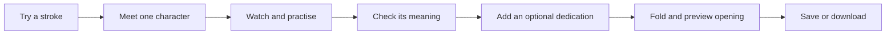

# Ink & Wishes: a more personal first lesson

Research and design proposal · Revision 2 · September 23, 2026

Branch: `design/personal-learning-experience`

Status: revised at the student's request after a 78/100 assessment of the first plan. This document specifies the next prototype; implementation and learner testing are pending. The public site remains on the existing release.

## The feedback that starts this iteration

The student said that the website is confusing for people who do not speak Chinese, that the red-envelope interaction is uninteresting, and that the experience should feel more personal and intimate. They requested a new branch and ideas informed by established learning products.

Keep the existing visual direction: minimal paper and ink, restrained fluid-glass controls, a subtle ink-wash background, and red used for the gift. Keep calligraphy, cultural learning, saved work, and couplets as the subject.

The student then requested a grade and further suggestions, and asked the agent to revise the plan accordingly. This revision puts brush interaction before personal setup, defines a learning outcome, narrows the first build, and gives cross-device gifting its own milestone.

## What the current experience asks of a beginner

These observations come from the live studio's visible interface and the current source, not from interviews with learners.

- The opening character selector visibly shows Chinese characters, Pinyin, and stroke counts. English meanings are in the buttons' accessible names, but the visible meaning is shown only for the selected character. A sighted newcomer cannot easily compare the choices.
- The initial character is **福 · fú**, with 13 strokes. The library already contains simpler options, including **山 · shān**, with three strokes.
- Choosing a character, reading a cultural story, taking a quiz, watching a reference, drawing, adjusting a brush, and making a gift compete for attention. There is no single recommended first action.
- At the inspected 1280 × 720 viewport, the drawing surface extends below the first screen and the main gift action is below the fold. Several secondary labels are small and faint.
- Pronunciation is written in Pinyin, but there is no audio playback. A beginner may not know how to say what they are writing.
- The envelope is currently a tilted canvas preview with save/download actions. It has no recipient, personal message, folding, sealing, or opening sequence. Its printed message is the same for everyone.
- The couplet workshop offers several parts and Chinese terms before a newcomer understands the finished arrangement.

Design hypothesis: a clear sequence and a personally meaningful outcome could make the existing features easier to approach. This still needs testing with people who do not read Chinese.

## Research: patterns worth adapting

The review covers official product explanations and public websites, not a full signed-in test of each product. Their features are precedents, not evidence that the proposed changes will improve this project.

| Reference | Observed pattern | Adaptation for Ink & Wishes |
| --- | --- | --- |
| [Duolingo: home-screen design](https://blog.duolingo.com/new-duolingo-home-screen-design/) | A guided path, smaller lesson units, and practice integrated into the sequence. | Recommend one next action. Put meaning, demonstration, practice, and a small check in the same short journey. Keep free practice available. |
| [HelloChinese](https://www.hellochinese.cc/) | Short game-based lessons, handwriting, speaking support, and native-speaker videos. | Pair the written character with its meaning, Pinyin, and a reviewed voice recording; let learners hear, watch, and then write. |
| [Brilliant: how learning works](https://brilliant.org/faq/) | Interactive problems and visual models with explanations and immediate feedback. | Teach one brush or stroke-order idea through a small action, with a useful explanation after a mistake. |
| [Slowly](https://slowly.app/) | Letter writing, sealing/stamping, and a deliberate delivery ritual. This is a correspondence product, not a learning platform. | Make preparing and opening a personal gift the completion ritual. A prototype can offer an immediate recipient preview. |

## What changed after the assessment

| Weakness in revision 1 | Decision for revision 2 |
| --- | --- |
| Choosing a recipient and a wish delays the first enjoyable action. | Put a brush surface first; ask for an optional dedication after practice. |
| Finishing a drawing does not demonstrate learning. | Define one meaning-recall check and distinguish guided practice from verified handwriting skill. |
| Personalization relies mainly on names and a message. | Make the visitor's handwriting central; add a genuine creator voice and handwriting replay in a later milestone. |
| A sender preview leaves the receiving experience unfinished. | Separate the first downloadable keepsake from a second milestone with an actual recipient link. |
| Too many features compete for the first build. | Build one guided character lesson, one meaning check, and one fold/seal/open interaction. |
| The assignment evidence is mostly a process description. | Keep a concrete before/after decision record with actual prompts, changes, checks, and student reflection. |

## Revised concept and first-use journey

**Try a little ink. Learn one character. Keep a wish in your own handwriting.**

Open directly on a small writing surface with this instruction:

> Try one stroke.
>
> Move slowly, then lift. See what your hand can make.
>
> **Continue to my first character** · Watch a demonstration

The paper is interactive immediately. No name, account, recipient, or character-selection form comes first. Show a tiny finished keepsake nearby so visitors can understand the outcome. Keep free practice and the existing couplet workshop accessible.

These are actions, not seven separate setup screens. Keep a consistent writing desk with four short stages: **Try ink → Learn → Personalize → Keep**. Each stage has one obvious next action. Returning to an earlier stage preserves the draft.

Design targets: reach the first brush interaction within 30 seconds and complete the guided keepsake in about five minutes. These are targets for observation, not verified performance claims or countdown timers.

## One learning outcome, with an observable check

For the provisional 安 lesson, the outcome is: **recognize 安 as the character taught for peace or safety, and practise following its modeled stroke sequence.**

- Teach the visible English meaning alongside **安 · ān**. Keep the reference near the hand and show one stroke direction with one plain-English instruction at a time.
- Offer **Watch → Trace → Try on my own**. Trying without a guide is optional; beginners can return to the reference without losing work.
- After practice, hide the meaning and Pinyin and ask one question: “What does 安 mean in this lesson?” Offer distinct English answers, explain a wrong choice, and allow another attempt. The visitor can skip and continue to their keepsake.
- During the learner trial, also ask the visitor to explain the meaning in their own words with the hints hidden. Record first answers, help, and corrections separately.
- Describe completed writing as “practised.” Manual progression through the reference is not automatic stroke recognition, and this build will not certify correct shapes or grade artistic quality.

Warm-up strokes use a separate scratch area so they do not accidentally appear on the final keepsake. Offer a brief demonstration for people who cannot or do not want to draw; the meaning lesson, check, and navigation remain keyboard-accessible. Saving an original handwritten piece still requires actual user marks.

### Choose the first character through observation

Use 安 provisionally because it fits the peace keepsake and is already in the library. Its six strokes alone do not establish that it is easier to learn than another character.

Before finalizing the entry lesson, use the existing 安 and 山 references for short exploratory attempts with three beginners. Vary which character is shown first, and record where participants ask for help, lose the sequence, or misunderstand the meaning. Do not build two complete gifting journeys for this comparison. If 安 creates more confusion, use 山 for the introductory lesson and keep 安 as a later wish lesson, with appropriate wording for each.

Three observations can help choose the next prototype; they cannot establish a general ranking of character difficulty.

## Milestone 1: a complete, small keepsake prototype

Deliver one guided lesson, one meaning check, and one envelope interaction. Reuse the existing brush, licensed character data, export renderer, and collection. Keep all current lessons and couplets reachable through the existing studio.

| Stage | Included behavior | Completion evidence |
| --- | --- | --- |
| Try ink | Immediate paper interaction; optional slow/quick comparison; a demonstration alternative. | A newcomer can find the first action without explanation. |
| Learn | One character with visible English, Pinyin, adjacent stroke guidance, and the meaning check. | Observe the learner's first meaning answer and requests for help. |
| Personalize | Optional recipient, short note, and sender name, introduced after writing. “Keep it for myself” and “Continue without a note” are equally available. | Skipping all personal fields still produces a usable keepsake. |
| Keep | Button-driven fold, seal, and opening preview; save an editable work; download a static composition containing the handwriting and any dedication. | Save/reload and an inspected PNG preserve the actual artwork and text. |

### Make the envelope feel cared for

Keep the actual drawn character on the red front. Place the optional dedication on an inner card. **Fold envelope** closes the flap; **Seal** places a small mark; **Preview opening** lifts the flap and reveals the card. These form one short finishing interaction, with a direct **Save now** option for anyone who wants to skip the ceremony.

Use a brief paper shadow and flap movement. Every stage has a labeled button usable by pointer, touch, and keyboard. Dragging, custom seal design, and sound are outside the first milestone. Reduced-motion mode presents the same states without movement. Text and controls must remain readable against the glass and ink wash.

Preserve handwriting imperfections in the result; do not replace the visitor's marks with a font. Show the optional recipient and creation date in the collection. Preserve existing saved works when adding optional metadata, explain the three-work limit, and require an explicit choice before replacement.

Call the result a **digital keepsake**. Use **Preview opening** and **Download image** as distinct actions. A PNG contains a static composition, not the animation. Do not display “sent” or promise a recipient link in this milestone.

## Milestone 2: let someone actually receive the wish

After evaluating the first prototype, build a recipient view that can be opened on a different device. The visitor sees the dedication, opens the envelope, and learns the character's English meaning without completing the lesson or creating an account.

Acceptance for sharing: create a link, open it in a separate browser or device with no sender storage, and confirm that the correct handwriting and note appear. Sharing must use an explicit action, show what will be shared, and explain who can access the link. Select the sharing approach after checking artwork size and hosting needs; the plan does not assume browser-local saved data will be available to a recipient.

Add **Watch how this wish was made** to replay the actual stored stroke order. Keep a skip control and a static reduced-motion view. Ordered stroke playback may use a consistent pace. Reproducing the maker's actual timing would require new timing data and must not be claimed for older drawings that lack it.

This is also the right place for a short, genuine human contribution: an optional pronunciation recording or a “From the creator” note explaining why the student chose the character. The student supplies any personal memory; the agent can help edit it. Obtain permission for recordings and have pronunciation reviewed by a fluent speaker. Show a **Hear it** control only when a reviewed recording exists. Audio is not a blocker for the first prototype, and pronunciation is not assessed by that prototype.

## Later ideas, outside the first two milestones

- **Stroke detective:** predict the next stroke and receive an explanation, using existing licensed data.
- **Memory collection:** compare earlier and later attempts and add a personal reflection. Keep this separate from automatic aesthetic scoring.
- **Couplet doorway guide:** start with an English explanation and a full doorway; label **Right strip**, **Left strip**, and **Top banner**, with Chinese terms underneath. Offer a sourced example first and custom composition afterward.
- **More lesson choices:** expand the guided journey after observing the first one. Keep existing studio choices available throughout.

This revision does not add a live AI tutor, accounts, a competitive points system, or a larger lesson catalogue to the prototype. The homework's agentic workflow is demonstrated through real development decisions and evidence.

## Cultural and visual rules for the build

- Keep the minimal ink-wash background, expressive brush marks, and restrained fluid-glass tools. Place text on a stable, readable surface; keep the opening instruction and action visible on desktop and phone.
- Keep literal meanings separate from personal dedications. “A little peace for your new beginning” is an example message, not a literal translation of a traditional saying.
- Have a fluent reader review the meaning, Pinyin, English stroke instructions, and cultural wording against the recorded sources and licensed stroke model. Record corrections and remaining uncertainty.
- Explain the red-envelope inspiration briefly and link the fuller source note. Describe the digital card and seal interaction as a contemporary design; do not invent a universal tradition around it.
- Keep “How this was made” easy to reach in the footer and repository. A broad navigation redesign is not required for the first experiment.

## Checks and the learner trial

Implementation checks for milestone 1:

1. The first paper interaction is available without completing a form. English labels explain the character and each next action.
2. Back navigation preserves strokes and optional text; warm-up marks stay out of the artwork; older saved works still open.
3. Skipped personal fields and a skipped or retried meaning check do not prevent finishing. Feedback never equates a completed drawing with demonstrated mastery.
4. Saved/reopened work and the exported image preserve the actual strokes and optional dedication. Long names and notes have clear input limits and fit the composition. User text is rendered as text, not HTML.
5. Fold/seal/open, skip, save, and download work by keyboard and pointer. Reduced-motion mode exposes the same content. Demonstration and meaning activities remain usable without canvas drawing.
6. Inspect a narrow phone viewport and a desktop viewport; test mouse drawing and a real touch device when available. Report physical-device checks as pending until performed. Inspect the actual downloaded image.
7. Run existing automated checks; add focused checks for changed saved-data handling and envelope state transitions. Documentation-only edits do not require running application tests.

Then observe three people who do not read Chinese using the first prototype. Ask them to make and keep their first character, without narrating the interface. Help when needed, but record that help. Use the same short task and questions for each participant.

| Participant | First action / time | Meaning response with hints hidden | Help or confusing step | Save completed | What felt personal? |
| --- | --- | --- | --- | --- | --- |
| P1 | Pending | Pending | Pending | Pending | Pending |
| P2 | Pending | Pending | Pending | Pending | Pending |
| P3 | Pending | Pending | Pending | Pending | Pending |

Record task time against the five-minute design target, the first meaning answer separately from a corrected answer, and whether saving was unaided. Ask “Which part felt personal?” and allow “none” as a useful answer. Choose the next change from the observed obstacle. This is an exploratory usability check, not evidence of long-term learning effectiveness.

## Homework evidence and the agent workflow

Keep one concrete record of **student feedback → agent proposal → student decision → changed artifact → check → reflection**. Link the real prompt or a clearly labeled faithful excerpt, the commit, and the actual verification note. Never substitute planned tests for results.

The example already available for this planning iteration is:

| Evidence | Actual status |
| --- | --- |
| Student feedback | Beginners find the site confusing; the envelope should feel more personal. |
| First agent proposal | Recipient-first onboarding and a character-to-gift journey, recorded in revision 1. |
| Review | The agent scored that plan 78/100 and identified onboarding friction, learning-check gaps, and the unfinished recipient experience. |
| Student decision | “ok fix the plan based on ur suggestion” |
| Changed artifact | Revision 2 puts a brush action first, moves dedication later, defines a meaning check, and separates keepsakes from recipient sharing. |
| Verification | Check this document for consistent scope, working internal links, and an explicit test plan. Implementation and learner results remain pending. |
| Student reflection | To be written by the student after trying the prototype; do not invent their experience. |

Useful vocabulary: the **branch** separates reviewable work from the published release; **context** includes the student's feedback and existing code; **constraints** preserve the visual direction and saved work; the **prototype** is the smallest complete journey; **evaluation** checks behavior and observes learners; the next **iteration** responds to the results.

## Rubric retained for the next review

These are the original plan-review scores. Revision 2 addresses the identified gaps, but no higher score is claimed merely because the document changed. A future review must identify whether it grades the plan, the working prototype, or learner evidence.

| Criterion | Weight | Revision 1 score | Evidence to examine next |
| --- | ---: | ---: | --- |
| Beginner clarity | 20 | 16 | Time to first action; English comprehension; help needed. |
| Learning value | 20 | 14 | Meaning response without hints; understandable stroke guidance; honest completion language. |
| Personal connection | 20 | 16 | Learner comments; original handwriting and dedication; actual receiver experience in milestone 2. |
| Feasibility and focus | 15 | 12 | One working lesson/check/envelope flow before additional features. |
| Accessibility and cultural care | 10 | 8 | Keyboard and reduced-motion checks; reviewed wording and sources. |
| Homework evidence | 15 | 12 | Actual prompts, decisions, before/after artifacts, checks, and student reflection. |
| **Total** | **100** | **78** | Reassess against the same criteria and state what is still unverified. |

The student remains the decision-maker. One coding agent researched and revised this plan; no multi-agent team or learner study is claimed.
